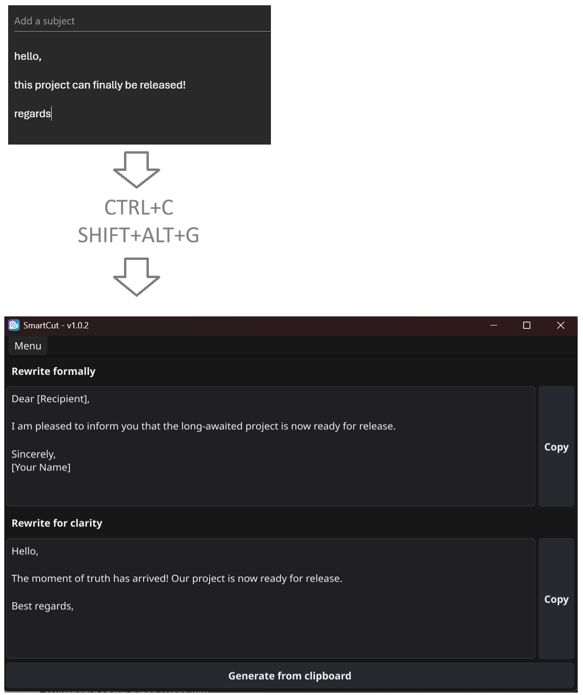

# SmartCut

This application designed to facilitate the invocation of pre-defined prompt sequences through shortcuts.

I created this project because I frequently reuse the same prompts throughout my day-for rewriting messages, adjusting email tone, or rephrasing content. The goal is to cut down on repetitive steps and make the process faster and easier.

## Features
- **Custom Prompts** – Create and manage your own prompt workflows.  
- **Flexible Model Choice** – Connect to the AI model of your preference.  
- **Quick Shortcuts** – Instantly run SmartCut on your clipboard with `Alt + Shift + G` (G stands for *Generate*).  
- **Always Up to Date** – SmartCut updates automatically.  
- **Local or Remote** – Works with both locally hosted and remote LLMs.  

## Installation

### Prerequisites

- **Ollama** – Install from [Ollama's website](https://ollama.com/).  
- Make sure Ollama is running before starting SmartCut.

### Setup

1. Go to the [SmartCut releases page](https://github.com/mouuff/SmartCut/releases).  
2. Download and extract the latest zip.  
3. Run the SmartCut binary - it works out of the box.

## Example usage

## Building locally (section for developers)

### Prerequisites

Before building SmartCut, ensure you have the following installed:

- **Golang**: Download and install Golang from [the official website](https://golang.org/dl/).
- **Fyne**: Download and install Fyne from [Fyne's website](https://docs.fyne.io/started/).
- **Ollama**: Download and install Ollama from [Ollama's website](https://ollama.com/).

### Running from sources

`go run main.go`

### Building

`go build -ldflags -H=windowsgui cmd/smartcut/main.go`

### Packaging

`fyne package -app-id com.mouuff.smartcut -os windows -icon images/icon.png -release`
