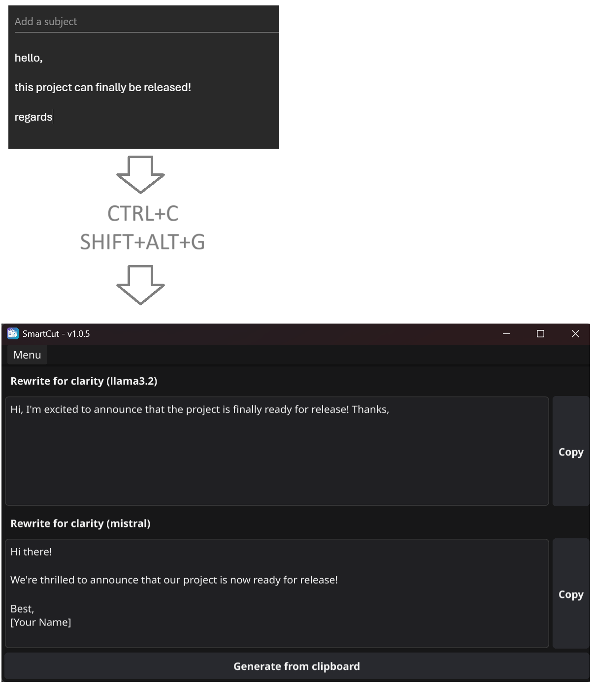

# SmartCut

SmartCut is an application designed to facilitate the creation and invocation of pre-defined prompt sequences through the use of custom shortcuts.

I created this project because I frequently reuse the same prompts throughout my day-for rewriting messages, adjusting email tone, or rephrasing content. The goal is to cut down on repetitive steps and make the process faster and easier.

## Features
- **Custom Prompts** – Create and manage your own prompt workflows.  
- **Flexible Model Choice** – Connect to the AI model of your preference.  
- **Quick Shortcuts** – Instantly run SmartCut on your clipboard with `Alt + Shift + G` (G for *Generate*).  
- **Always Up to Date** – SmartCut updates automatically.  
- **Local or Remote** – Works with both locally hosted and remote LLMs.  

## Example usage



## Installation

### Prerequisites

Before using SmartCut, ensure you have the following installed:

- **Ollama**: Download and install Ollama from [Ollama's website](https://ollama.com/).

To run Ollama in server mode, use the following command:

```sh
ollama serve
```

### Setup

Go to the [SmartCut releases](https://github.com/mouuff/SmartCut/releases) page.

Download the latest binaries zip (*.zip).

Extract the zip and run the SmartCut binary - it should work out of the box.
